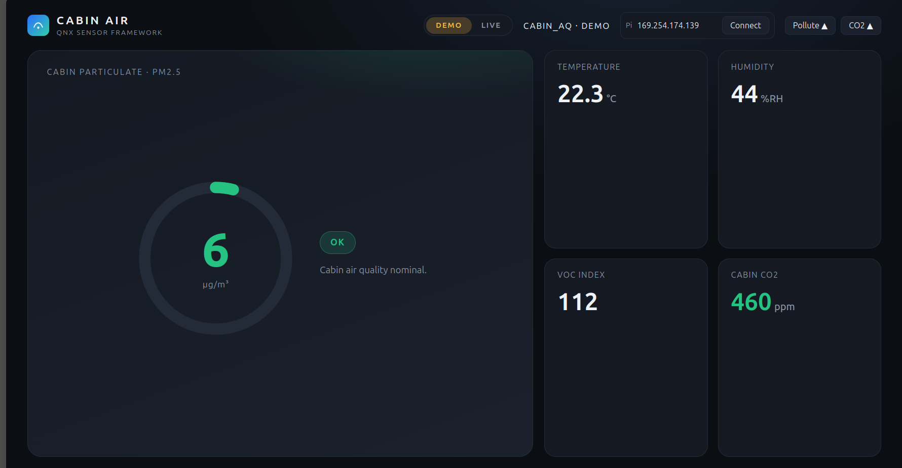
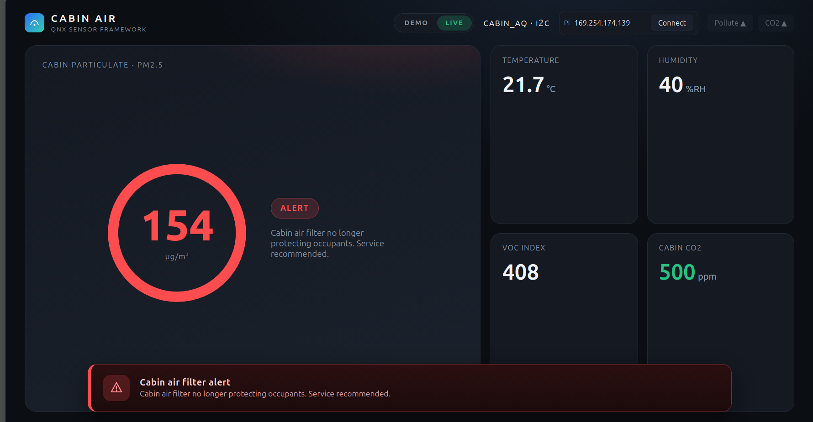

# Air quality on QNX: from an I²C sensor to COVESA VSS signals

An air-quality sensor on a real I²C bus, brought into QNX two ways: as a **COVESA-VSS-named
signal** in the QNX signal service, and as a first-class unit in the **QNX Sensor
Framework**. Both run on QNX 8.0 on a Raspberry Pi, and both drive a car-cabin
"infotainment" screen that turns red when the cabin air is no longer clean.

> **The signals used here are now filed with COVESA**, because the standard has no way to
> describe air quality yet:
> [issue #930](https://github.com/COVESA/vehicle_signal_specification/issues/930) ·
> [PR #931](https://github.com/COVESA/vehicle_signal_specification/pull/931).
> Filed, not merged. See [`vss/`](vss/).

```
$ cat /dev/qpp/Vehicle/Cabin/AirQuality/PM25?text
119.000000
```




*The infotainment screen: green while the cabin air is clean, and red with a "cabin air filter no
longer protecting occupants" alert when particulates climb. The second screen is reading a real
sensor over I2C, shown by `LIVE · I2C` in the top bar.*

## Start here: [`vss/`](vss/)

`Vehicle.Cabin.AirQuality.PM25` is not a signal that exists yet. **COVESA VSS has no
air-quality signals at all, and no concentration units** to express them in. Verified across
master, v6.0 and v5.1.

So [`vss/`](vss/) contains a proposal to add them, validated with COVESA's own toolchain and
filed upstream as
[issue #930](https://github.com/COVESA/vehicle_signal_specification/issues/930) and
[PR #931](https://github.com/COVESA/vehicle_signal_specification/pull/931). Alongside it are
two working programs that publish a physical sensor into the QNX signal service under those
names. One reads the I²C bus directly. The other bridges an existing Sensor Framework unit.

That is the part of this repository most worth reading.

## The two paths

```
                                        ┌─  aq_signal_publisher  ─────────────┐
  air-quality sensor  ──  I²C  ──────────┤   (reads the bus directly)         │
                                        │                                     ▼
                                        │                          QNX signal service (QPP)
                                        │                          /dev/qpp/Vehicle/Cabin/
                                        │                              AirQuality/PM25
                                        │                                     ▲
                                        └─  external_sensor driver  ──────────┤
                                           → QNX Sensor Framework             │
                                           → aq_signal_connector  ────────────┘
                                           → aq_publisher → HTTP SSE → browser / Android IVI
```

**The signal-service path** models the sensor as what it is: a few scalars per second, named
and typed by a standard catalog, readable by any POSIX client. No shared header required.

**The Sensor Framework path** is the layer that gets data off the wire. The framework ships
native formats for cameras, LiDAR, radar, GPS, IMU and CAN, but has no air-quality format, so
the driver rides on `SENSOR_FORMAT_USER_DATA` with a packed `aq_sample_t` payload. That is the
framework's supported route for a sensor type it does not model natively. It works, and it
also feeds the SSE stream that drives the IVI screens above.

The two compose: the same driver can feed the signal service through the bridge connector.

## What's in here

| Path | What it is |
|------|-----------|
| [`vss/`](vss/) | **The COVESA VSS proposal and the QNX signal-service integration.** Two connectors, the signal catalog, the validation record, and what was verified on hardware. |
| `driver/` | The QNX `external_sensor` air-quality driver (`aq_external_sensor.{h,cpp}`). Bus-agnostic, with a live software simulator and a real I2C read path. |
| `driver/teensy_aq_i2c_slave/` | A Teensy I2C-slave sketch that emulates an air-quality sensor, so the real I2C path can be exercised on actual hardware using a stand-in sensor. |
| `publisher/` | `aq_publisher.cpp`, a `libsensor` client that subscribes to the sensor unit, decodes the payload, and re-publishes each sample as an HTTP Server-Sent-Events stream. |
| `ivi/` | A single-file browser car-infotainment screen that consumes the SSE stream and shows the cabin-air state and alerts. No build step. |
| `configs/` | Sensor-service config blocks for the simulator and I2C buses. |
| `scripts/` | `demo.sh` to deploy and drive both paths over qconn (`sim`/`i2c`/`publisher` for the Sensor Framework demo, `vss-*` for the signal service), plus small qconn helpers. |

## Two alerts

1. **Cabin filter / particulate**, driven by PM2.5. When cabin particulates climb past the
   threshold the screen goes red with a "cabin air filter no longer protecting occupants" banner.
   This sits on a real particulate reading.
2. **Cabin CO2 buildup**, driven by CO2, for the case where occupants breathe up a sealed cabin on
   recirculation. This is a roadmap-level feature: a sensor that reports estimated eCO2 derived from
   a VOC channel is not a substitute for true NDIR CO2, so a trustworthy version needs a real NDIR
   CO2 sensor. It is demonstrated here with simulated data and clearly marked as such in the code.

## Requirements

### Hardware

- A **Raspberry Pi 4** (recommended; the official QNX image targets the 4B) or a **CM4** with a
  carrier board, plus its power supply and a **microSD card (8 GB or larger) and a way to flash it**.
- A **host computer** (Linux, or Windows via WSL) with a network link to the Pi: WiFi, or
  an Ethernet cable for a direct wired link.
- For the real I2C path, one of:
  - a **Teensy 4.0** flashed as the sensor emulator (a bare Teensy ships without headers, so you
    need soldered headers or test clips), or
  - a real **I2C air-quality sensor**.
- **3 female-to-female jumper wires** for the I2C link (SDA, SCL, GND), plus a **USB cable** for the
  Teensy (micro-USB on the Teensy 4.0).

The **simulator bus needs no sensor hardware at all**, just the Pi, so you can run the
whole pipeline before wiring anything up.

### Software

- **QNX Everywhere (QNX 8.0)** on the Pi (the free evaluation image).
- The **QNX Software Development Platform 8.0** with the Sensor Framework examples package
  on the host, to build the driver and publisher. Full steps in [`SETUP.md`](SETUP.md).
- For the signal-service path, **QPP** built from
  [github.com/qnx/qnx-posix-publish-subscribe](https://github.com/qnx/qnx-posix-publish-subscribe).
  It does not ship in the SDP.
- To flash the Teensy, the Arduino toolchain (see
  [`driver/teensy_aq_i2c_slave/README.md`](driver/teensy_aq_i2c_slave/README.md)).

## Try it

The whole Sensor Framework pipeline runs with no sensor hardware at all, on the software
simulator bus:

```bash
# from your host; these drive the QNX target over qconn
./scripts/demo.sh httpd &      # serve the build artifacts to the target
./scripts/demo.sh deploy       # copy the driver, configs, and publisher onto the target
./scripts/demo.sh sim          # start the sensor service on the simulator bus
./scripts/demo.sh publisher sim

# serve the IVI and open it in a browser
./scripts/demo.sh ivi          # http://localhost:8080
```

Force the filter alert with `./scripts/demo.sh sim-pollute` then `./scripts/demo.sh publisher sim`
(`sim-pollute` restarts the sensor service, so restart the publisher too); `./scripts/demo.sh sim-co2`
does the same for the CO2 alert. The browser IVI also has a self-contained **Demo** mode with pollute
and CO2 buttons, so you can see both alerts with nothing else running.

To exercise the real I2C path, flash the Teensy emulator and wire it to the Pi's I2C pins (wiring and
flashing are in [`driver/teensy_aq_i2c_slave/README.md`](driver/teensy_aq_i2c_slave/README.md)), then
use the `i2c` subcommands instead of `sim`.

Set `QNX_IP` and `LAPTOP_IP` to match your network before running `demo.sh` (the addresses in the
script are examples).

For the signal-service path, see [`vss/README.md`](vss/README.md).

## Building

The driver builds in the Sensor Framework SDP package tree with `qcc` (aarch64le) into
`libaq_external_sensor.so`, and is loaded by referencing the `.so` from a `SENSOR_UNIT` block.
**[`SETUP.md`](SETUP.md) is the full setup guide**: SDP prerequisites, where the source goes in the
example tree, building, reaching the target, and deploying. Per-component notes are in
[`driver/README.md`](driver/README.md) and [`publisher/README.md`](publisher/README.md).

The two signal-service connectors build from [`vss/connector/`](vss/connector/):
`make publisher` builds the direct path and needs nothing but the SDP environment, while
`make` also builds the bridge, which links `libsensor` and therefore needs the Sensor
Framework example package installed as well.

## Status

Verified on a Raspberry Pi CM4 running QNX 8.0, over a real I2C bus:

- The driver streams `SENSOR_FORMAT_USER_DATA` on both the simulator and I2C buses, and the
  alert path fires end to end through the publisher and the browser IVI.
- The signal service boots from the air-quality catalog with all 17 signals present, and both
  connectors publish live sensor values into it. The direct publisher ran with no sensor
  service on the system at all.
- The VSS proposal passes COVESA's own toolchain in strict mode.

Sensor data in this repository is emulated: the device on the I2C bus is a Teensy standing in
for a production air-quality part, so the bus, driver, framework, connectors and signal service
are real while the numbers are generated. Wiring in a production sensor is a matter of filling
in the one bus-read function for that part. Details and measured values:
[`vss/VERIFIED_ON_TARGET.md`](vss/VERIFIED_ON_TARGET.md).

## Acknowledgments

Developed in collaboration with [EcoSafeSense](https://ecosafesense.com).

## License

MIT, except the COVESA-derived spec files under `vss/proposal/`, which carry COVESA's MPL-2.0.
See [`LICENSE`](LICENSE).
